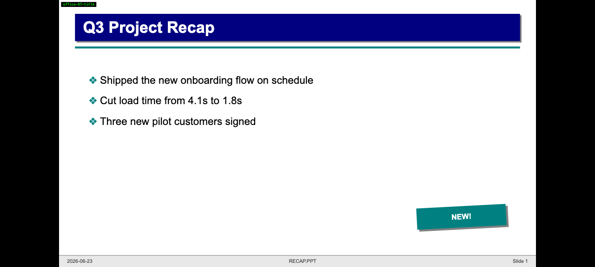
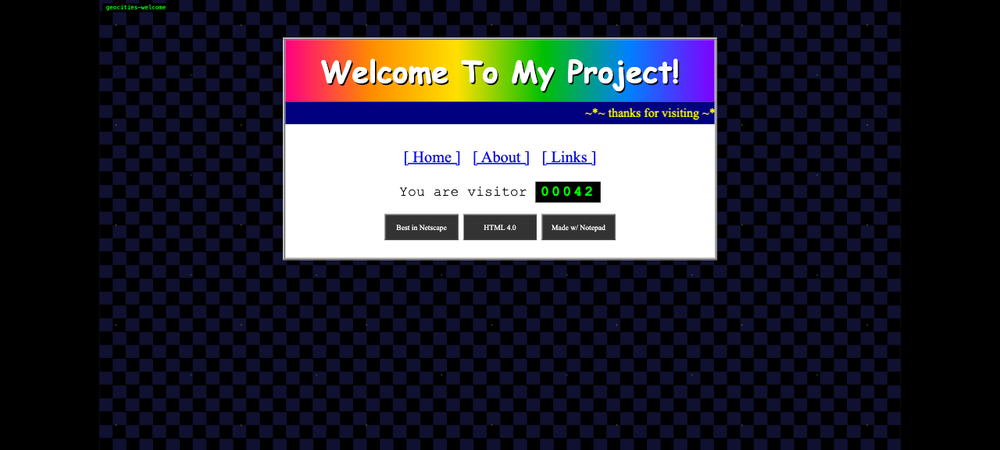
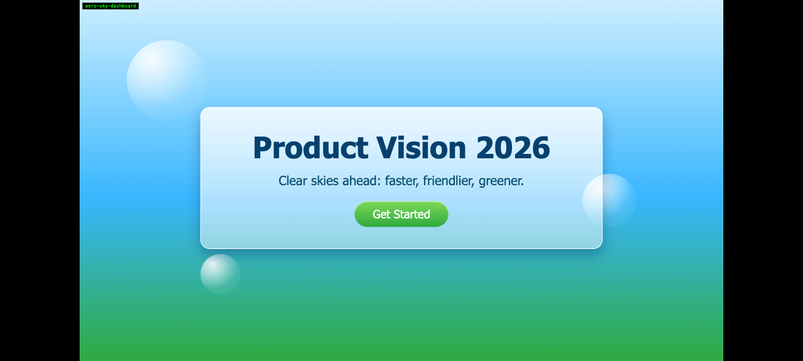
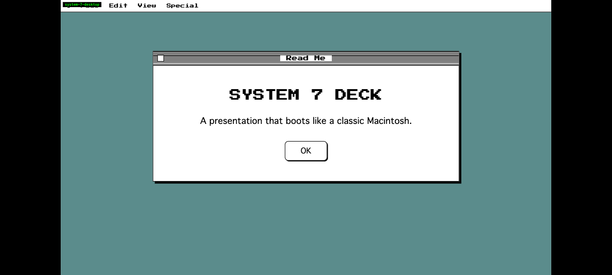

# Frontend Slides (Nostalgia Edition)

A coding-agent skill for creating nostalgic, hand-crafted HTML presentations from scratch or by converting PowerPoint files. The core `SKILL.md` can be read by coding agents with filesystem and shell access.

This edition is intentionally **not** for polished professional/business decks. It is for people who miss crafting PowerPoint slides by hand, making goofy homepage layouts, and letting a deck feel casual, personal, and visibly made.

Based on the original **Frontend Slides** skill by [Zara Zhang (@zarazhangrui)](https://github.com/zarazhangrui). This Nostalgia Edition reworks her project's styles and template pack into an old-web / old-PowerPoint aesthetic.

## Screenshots

A few representative nostalgia directions from the template pack:

| Office 97 / PowerPoint | GeoCities / Web 1.0 |
| --- | --- |
|  |  |
| Navy title bar, teal AutoShapes, hard shadows, footer strip. | Star tile, rainbow Comic Sans header, marquee, visitor counter, badges. |

| Frutiger Aero | System 7 Desktop |
| --- | --- |
|  |  |
| Sky/grass gradient, glossy bubbles, glass panel, green gel button. | Classic Mac menu bar, bitmap window chrome, pinstripe title bar, 1px borders. |

## What This Does

**Frontend Slides** helps non-designers create zero-dependency web presentations without knowing CSS or JavaScript. It uses a "show, don't tell" approach: instead of asking you to describe your aesthetic preferences in words, it generates visual previews and lets you pick what feels right.

### Key Features

- **Zero Dependencies** — Single HTML files with inline CSS/JS. No npm, no build tools, no frameworks.
- **Visual Style Discovery** — Can't articulate design preferences? Pick from generated visual previews.
- **PPT Conversion** — Convert existing PowerPoint files to web, preserving images and content.
- **Nostalgia-First Design** — Office 97, GeoCities, FrontPage, Netscape, Aqua, Frutiger Aero, System 7, Kid Pix, and Memphis computer-lab styles.
- **Authentic Ugly, Still Readable** — Comic Sans, WordArt, bevels, tiled backgrounds, marquees, counters, bitmap windows, and glossy gel buttons are allowed. Unreadable text is not.
- **Fixed 16:9 Stage** — Every slide is authored at 1920×1080 and scaled as a whole to fit the viewport.

## Installation / Use

This repo is meant to be used as a plain coding-agent skill, not as a Claude Code plugin.

### Claude Code Manual Installation

Copy the skill files to your Claude Code skills directory:

```bash
mkdir -p ~/.claude/skills/frontend-slides-nostalgia/scripts
cp SKILL.md STYLE_PRESETS.md viewport-base.css html-template.md animation-patterns.md ~/.claude/skills/frontend-slides-nostalgia/
cp -R nostalgia-template-pack ~/.claude/skills/frontend-slides-nostalgia/
cp scripts/extract-pptx.py scripts/deploy.sh scripts/export-pdf.sh ~/.claude/skills/frontend-slides-nostalgia/scripts/
```

Or clone directly:

```bash
git clone https://github.com/leovoon/frontend-slides-nostalgia.git ~/.claude/skills/frontend-slides-nostalgia
```

Then use it in Claude Code as a manually installed skill. This repo does not provide a marketplace plugin.

### Other Coding Agents

Clone it wherever your agent can read files:

```bash
git clone https://github.com/leovoon/frontend-slides-nostalgia.git
```

Then ask your coding agent to use the Frontend Slides Nostalgia skill and point it at this repo:

```text
Use the Frontend Slides Nostalgia skill from https://github.com/leovoon/frontend-slides-nostalgia
```

If the agent can read repos or local files, it should start from `SKILL.md` and load only referenced support files it needs:

- `STYLE_PRESETS.md`
- `viewport-base.css`
- `html-template.md`
- `animation-patterns.md`
- `nostalgia-template-pack/`
- `scripts/`

## Usage

### Create a New Presentation

```text
Use this repo's SKILL.md. Make me a casual old-PowerPoint deck about my weekend project.
```

The skill will:

1. Ask about purpose, length, content, and density.
2. Generate 3 visual style previews from different nostalgia directions.
3. Let you pick or mix a visual direction.
4. Create the full presentation in your chosen style.
5. Open it in your browser.

### Convert a PowerPoint

```text
Use this repo's SKILL.md. Convert my presentation.pptx to a web slideshow, but make it feel like PowerPoint 97.
```

The skill will:

1. Extract text, images, and notes from the PPT.
2. Show extracted content for confirmation.
3. Let you pick a visual style.
4. Generate a single-file HTML presentation with the original assets.

## Included Styles

### Lightweight Presets (`STYLE_PRESETS.md`)

**Office 97 / PowerPoint**

- **Office 97 Default** — Navy title, teal AutoShapes, Arial, footer strip, Wingdings bullets.
- **PowerPoint Blue Daybreak** — Full blue gradient, white shadowed title, outlined content well.
- **WordArt Rainbow** — Rainbow WordArt, starbursts, 3D shadows, slide-art chaos.

**GeoCities / Web 1.0**

- **GeoCities Homepage** — Tiled stars, centered table, marquee, counter, badges.
- **FrontPage Webmaster** — Visible tables, raised nav buttons, default blue links.
- **Under Construction** — Hazard stripes, warning panel, blinking sign energy.

**Y2K / Aqua / Frutiger Aero**

- **Aqua Gel** — Pinstripes, gel buttons, candy progress bars, iMac optimism.
- **Frutiger Aero** — Sky/grass gradient, bubbles, translucent panels.
- **Y2K Chrome** — Metallic swoosh, cyan flares, dotcom future hype.

**System 7 / Kid Pix / Memphis**

- **System 7 Desktop** — Mac menu bars, 1px windows, dithered gray, stippled desktop.
- **Kid Pix Canvas** — Tool palette, stamps, spray speckles, crayon colors.
- **Memphis Computer Lab** — Confetti, squiggles, worksheet cards, primary shapes.

### Nostalgia Template Pack

The heavier [`nostalgia-template-pack`](nostalgia-template-pack/selection-index.json) includes 16 detailed design systems:

1. `office-97-title`
2. `powerpoint-blue-daybreak`
3. `wordart-rainbow-splash`
4. `comic-sans-casual`
5. `geocities-welcome`
6. `under-construction`
7. `frontpage-table-web`
8. `badge-wall-88x31`
9. `bondi-aqua-boot`
10. `chrome-swoosh-hero`
11. `aero-sky-dashboard`
12. `brushed-metal-player`
13. `system-7-desktop`
14. `kid-pix-canvas`
15. `about-this-macintosh`
16. `memphis-confetti-card`

Each template has:

- `preview.md` — small selection card for style previews.
- `design.md` — full design-system recipe for final deck generation.

## Fixed Stage Model

Every deck uses a fixed 16:9 canvas:

- Slides are authored at **1920×1080**.
- The stage scales uniformly to fit the viewport.
- Slides do not reflow for phones; they letterbox/pillarbox.
- Every generated deck must include the full contents of `viewport-base.css`.

Old-web layouts still obey this. A 760px GeoCities table lives inside the 1920×1080 slide stage; it does not become browser layout.

## Readability Floor

Authentic ugly is welcome. Unreadable is not.

- Main body text ≥ 28px on the 1920×1080 stage.
- Captions, footers, button labels ≥ 18px.
- Loud tiles or gradients require readable panels.
- Blink, marquee, sheen, and GIF-like animation cannot carry primary meaning.
- Max two attention-grabbing animation effects per slide.

## Supporting Files

| File | Purpose |
| --- | --- |
| `SKILL.md` | Main agent instructions |
| `STYLE_PRESETS.md` | 12 lightweight nostalgia presets |
| `nostalgia-template-pack/selection-index.json` | Compact template metadata |
| `nostalgia-template-pack/templates/*/preview.md` | Preview cards |
| `nostalgia-template-pack/templates/*/design.md` | Full design recipes |
| `viewport-base.css` | Mandatory fixed-stage CSS |
| `html-template.md` | HTML/JS architecture reference |
| `animation-patterns.md` | Animation references |
| `scripts/extract-pptx.py` | PPT extraction |
| `scripts/deploy.sh` | Deploy to Vercel |
| `scripts/export-pdf.sh` | Export to PDF |

## Export / Share

Generated presentations can be:

- opened locally in a browser,
- deployed with `bash scripts/deploy.sh <path-to-presentation>`,
- exported to PDF with `bash scripts/export-pdf.sh <path-to-html> [output.pdf]`.

## Credits

- Original **Frontend Slides** skill architecture and design philosophy by [Zara Zhang (@zarazhangrui)](https://github.com/zarazhangrui).
- Nostalgia Edition: restyled presets and template pack adapting that work into Office 97, GeoCities, Y2K/Aqua, and classic Mac aesthetics.

## License

MIT
